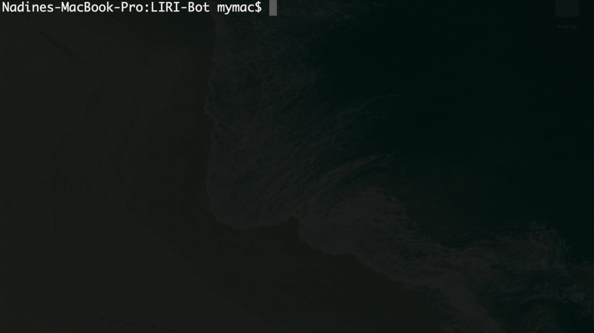
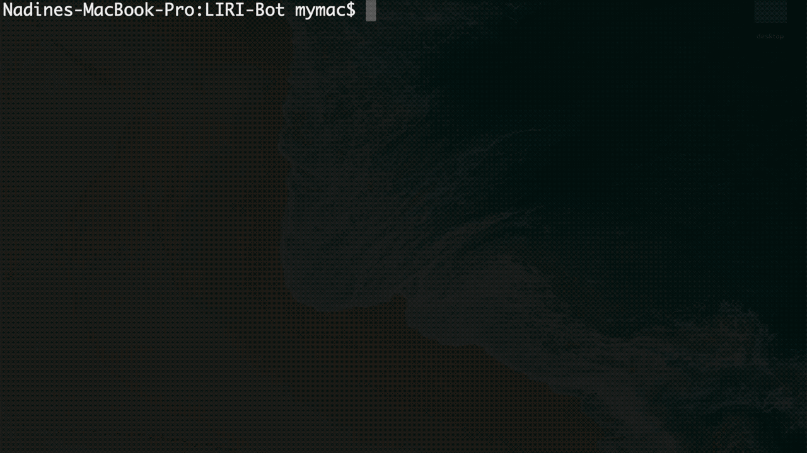
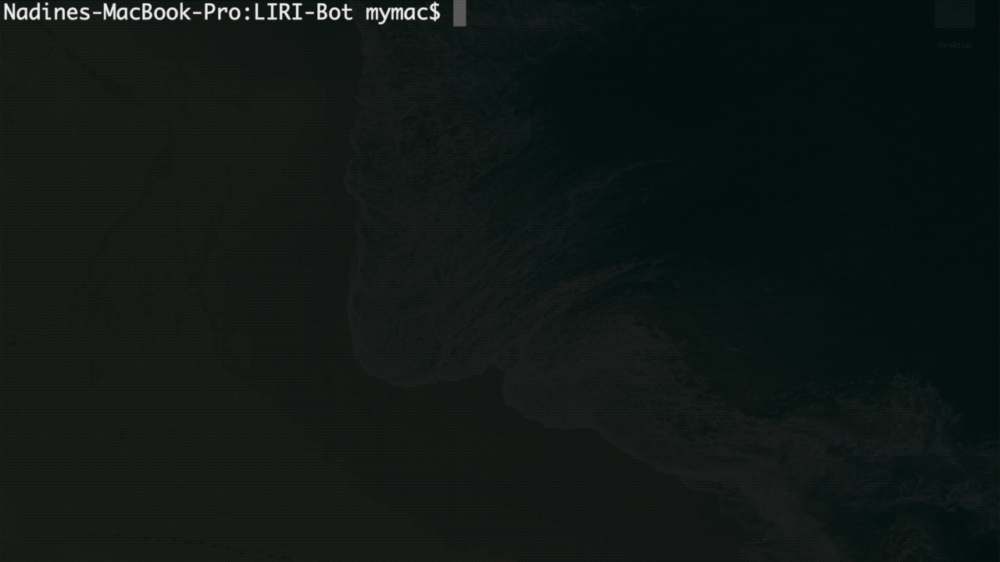

# LIRI-Bot

LIRI (Language Interpretation and Recognition Interface) is a command line Node.js app that takes in parameters and gives back data.

## What It Does

LIRI can...

* search the [Bands In Town API](https://artists.bandsintown.com/support/bandsintown-api) for a specific artist's or band's next concert date and location.

* search the [Spotify API](https://developer.spotify.com/documentation/web-api/) for a specific song's artist and album name, as well as a preview on Spotify.

* search the [OMDB API](http://github.com) for a specific movie's full title, release year, IMDB and Rotten Tomatoes rating, country, language, actors, and short plot summary.

* use an external .txt file to perform pre-written tasks.

## How to Run the App

Start LIRI with Node.js, add a command and search term.

Search for:

* upcoming concert details:
    ```
    node liri.js concert-this <'artist/band name'>
    ```


* song information and previews:
    ```
    node liri.js spotify-this-song <'song name'>
    ```


*  movie information:
    ```
    node liri.js movie-this <'movie title'>
    ```


* pre-written search terms:
    ```
    node liri.js do-what-it-says
    ```


## Technologies

* JavaScript
* Node.js with 
    * dotenv
    * fs
    * axios
    * moment
